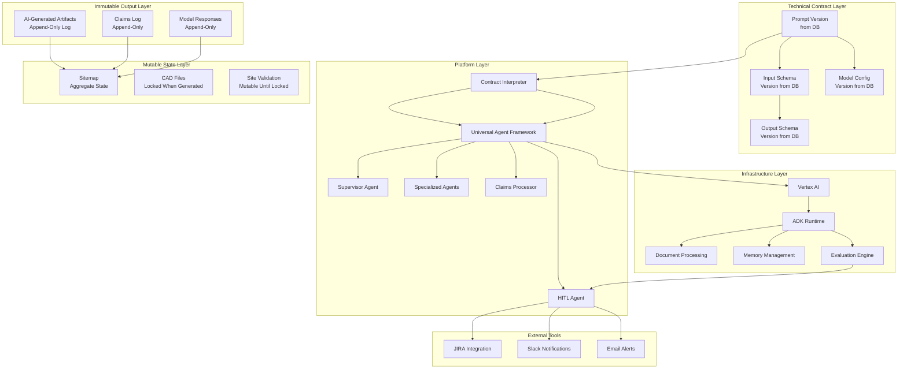

# Technical Architecture

## Agent-Based Framework

Our platform leverages Google's Agent Development Kit (ADK) with Vertex AI to implement a horizontally scalable, customer-agnostic system. The architecture follows a **Supervisor/Worker** pattern, utilizing **Domain-Driven Design (DDD)** to isolate business rules from technical orchestration.

### Core Components

*   **The Supervisor (Planner):** Acts as a "planner over missing claims." It identifies what evidence is required to reach a target schema version and delegates tasks dynamically.
*   **Domain Workers:** Specialized agents (e.g., RFDS Agent, Lease Agent) that are stateless and focused on generating specific claims.
*   **Stateless by Design:** We explicitly reject the "Stateful Graph" anti-pattern (like complex LangGraph chains). State is heavy, brittle, and difficult to debug. Instead, we treat state as a natural byproduct of the ecosystem:
    *   **Context:** The immediate working set of data (e.g., the current document).
    *   **Session:** The ephemeral interaction history (e.g., "Why did you choose that value?").
    *   **Memory:** The long-term persistent store of validated truths (The Database).

### Document Processing Pipeline

Traditional approaches that rely on stateless libraries often result in LLMs being run repeatedly over entire documents, which is not optimal. Our approach optimizes document processing by:

1. **Structured Data Extraction First**: Specialized parsers extract core data from documents (e.g., RFDS files) before LLM processing
2. **Targeted LLM Usage**: LLMs receive only the relevant, extracted information rather than entire documents
3. **Efficient Resource Allocation**: Reduces computational costs by minimizing unnecessary LLM calls
4. **Improved Accuracy**: Structured parsing provides more reliable foundational data for LLM reasoning

## Agent Orchestration Patterns

The architecture supports multiple agent orchestration patterns that work together:

### Supervisor/Worker Pattern
- **Supervisor Agent**: Acts as the central coordinator that delegates tasks to specialized workers
- **Worker Agents**: Specialized agents (e.g., RFDS Agent, Lease Agent) that focus on specific extraction tasks
- **State Management**: The supervisor maintains overall workflow state while workers remain stateless

### Parallel Processing
- **Concurrent Execution**: Multiple agents can process different document types simultaneously
- **Resource Optimization**: Distributes workload efficiently across available resources
- **Scalability**: Enables processing of multiple documents in parallel

### Looper Agents
- **Iterative Refinement**: Agents can refine their outputs through multiple iterations
- **Quality Assurance**: Continuous validation and improvement of results
- **Self-Correction**: Agents can identify and fix their own errors

## Infrastructure Management with ADK

**Solution with ADK:**
- Managed session state with ADK's built-in session management
- Automatic conversation history tracking for each agent
- Built-in state persistence and recovery
- Native support for long-term memory without custom implementation

## Model Options & Pricing

Our platform leverages the diverse model ecosystem available through Vertex AI, providing flexibility and cost optimization:

### Google Models
- [Gemini models pricing](https://cloud.google.com/vertex-ai/generative-ai/pricing#google_models)
- Advanced multimodal capabilities with massive context windows
- Optimized for complex reasoning and document analysis

### Partner Models
- [Mistral models pricing](https://cloud.google.com/vertex-ai/generative-ai/pricing#mistral-models)
- Alternative reasoning capabilities for specialized tasks
- Competitive pricing for high-volume workloads

### Open Source Models
- [Qwen models pricing](https://cloud.google.com/vertex-ai/generative-ai/pricing#qwen-models)
- Cost-effective options for specific use cases
- Data sovereignty for sensitive workloads

## Memory Management & Context Windows

### Advanced Memory Banks
Our platform utilizes [Vertex AI Memory Banks](https://cloud.google.com/agent-builder/agent-engine/memory-bank/generate-memories) for efficient long-term storage and retrieval of contextual information.

### Context Window Management
Unlike traditional approaches where adding RAG stores or message history can overload context windows, ADK implements sophisticated memory management:

- **Selective Context Loading:** Only relevant information is loaded into the active context window based on the current task
- **Memory Bank Integration:** Long-term memories are stored separately and retrieved on-demand rather than kept in the active context
- **Session State Management:** Conversation history is managed separately from the active context, preventing window overflow
- **Dynamic Context Optimization:** The system automatically determines which information is most relevant for the current decision, keeping the context window focused and efficient
- **Context Compaction:** ADK provides [context compaction capabilities](https://google.github.io/adk-docs/context/compaction/) to automatically summarize and compress context when needed, ensuring optimal performance even with extensive document sets

This approach ensures that adding more documents, conversation history, or RAG data doesn't simply overload the context window - instead, the system intelligently manages what information is actively available to the model at any given time.

## Knowledge Management & Retrieval

**Technical Contract-Based Approach:**
- **Versioned Schema Indexing:** Documents indexed based on versioned schemas rather than hardcoded categories
- **Cross-Customer Learning:** Insights from one customer's contracts improve others' processing
- **Adaptive Retrieval:** Retrieval strategies adjust based on versioned contract requirements
- **Cost-Benefit:** Managed solutions reduce operational overhead while maintaining cross-industry performance

## Visual Architecture

