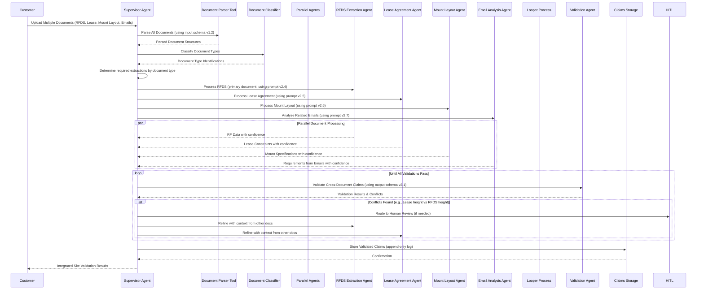

# Implementation Roadmap

## Phase 1: Telecom Excellence Preservation & Technical Contract Foundation (Weeks 1-8)
- Migrate existing telecom logic into versioned technical contract system
- Implement universal agent framework with versioned contracts
- Preserve proven telecom capabilities while abstracting hard-coded logic
- Establish CS-Engineering collaboration protocols for technical contract definition

## Phase 2: Technical Contract System (Weeks 9-16)  
- Implement dynamic agent configuration based on versioned technical contracts
- Deploy schema versioning and append-only logging systems
- Add SharePoint and other document connector integrations
- Implement HITL agent framework and external tool integrations

## Phase 3: Horizontal Expansion Platform (Weeks 17-24)
- Fine-tune cross-customer performance and accuracy
- Implement advanced technical contract-based provenance tracking
- Conduct security and compliance audits for multi-industry use
- Prepare for expansion to legal, financial, and healthcare verticals

## Real-World Example: Multi-Document Site Validation with Agent Orchestration

To illustrate how our technical contract-based approach works in practice, here's a real-world example of processing multiple document types for a telecom site validation using agent orchestration with parallel and looper processes:

### Agent Orchestration Process:

1. **Customer Initiation**: Customer uploads multiple documents (RFDS, Lease Agreement, Mount Layout, related emails) via SharePoint integration
2. **Document Classification**: System identifies document types and routes appropriately
3. **Parallel Processing**: Supervisor Agent initiates specialized extraction agents based on document type:
   - RFDS Extraction Agent processes primary radio frequency study
   - Lease Agreement Agent processes legal constraints and permissions
   - Mount Layout Agent processes structural specifications
   - Email Analysis Agent processes related communications for context
4. **Cross-Document Validation**: Validation Agent checks for consistency across all document types
5. **Conflict Resolution**: If conflicts arise (e.g., height restrictions in lease vs RFDS), system handles through HITL or refinement
6. **Claims Storage**: Results stored as immutable claims with full provenance tracking

### Technical Contract Elements in Action:

- **Prompt Versions**: Each agent receives document-type-specific, versioned prompts (e.g., RFDS Extraction uses prompt v2.4)
- **Input Schema Version**: Defines expected structure for each document type (input schema v1.2)
- **Output Schema Version**: Dictates final integrated output format (output schema v2.1)
- **Model Configuration**: Sets parameters for each agent's operation based on document type
- **Append-Only Log**: Records every interaction for auditability and traceability

This example demonstrates how the Supervisor Agent intelligently orchestrates specialized subagents for different document types using parallel processing and looper refinement cycles, while technical contracts ensure deterministic, verifiable processing across all document types.

## Evaluation Framework & Synthetic Data Generation

Recent developments from OpenAI, Anthropic, and Google have emphasized the critical importance of evaluations in shaping AI for specific business cases. AI models may seem vague and shaky initially, but that's the point - frontier AI requires lab work to properly evaluate and tune models for specific use cases.

### Synthetic Data Generation

Google has recently introduced synthetic data generation capabilities within the Vertex stack. Using templates, we can generate thousands or even millions of sample customer documents and run them through our pipeline for comprehensive testing. This approach allows us to:

- Test our system against diverse document types and edge cases
- Validate the accuracy of our technical contracts
- Identify potential issues before processing real customer data
- Build comprehensive evaluation datasets for continuous improvement

### Evaluation Best Practices

- **Template-Based Testing**: Create document templates that represent common customer scenarios
- **Synthetic Data Generation**: Use Vertex AI's capabilities to generate realistic test data
- **Continuous Evaluation**: Implement ongoing evaluation pipelines to monitor performance
- **Cross-Customer Benchmarking**: Compare performance across different customer verticals
- **Golden Dataset Creation**: Maintain high-quality sample documents with known outputs for regression testing

## Technical Architecture & Solutions

### 1. Infrastructure Management with ADK

**Current Issue:** Building and maintaining memory layers, chat history, and state management from scratch
- Requires custom database schemas for conversation history
- Complex locking mechanisms for concurrent access
- Serialization/deserialization overhead
- Custom retry and error handling logic

**Solution with ADK:**
- Managed session state with ADK's built-in session management
- Automatic conversation history tracking for each agent
- Built-in state persistence and recovery
- Native support for long-term memory without custom implementation

### 2. Observability & Monitoring

**Universal Monitoring System:**
- Integrated tracing and logging for all agent interactions across all customers
- Real-time performance metrics per versioned technical contract
- Cost tracking and optimization recommendations by customer
- Cross-customer performance degradation detection

### 3. Evaluation Framework

**Technical Contract-Based Testing:**
- Customer-specific evaluation metrics based on versioned contract requirements
- Cross-customer benchmarking to identify improvement opportunities
- Synthetic data generation based on versioned contract patterns
- Continuous evaluation pipelines for each versioned technical contract type

### 4. Deployment & CI/CD

**Customer-Agnostic Deployment:**
- One-click deployment of versioned technical contract-based agents
- Automatic traffic splitting for A/B testing between contract versions
- Rollback capabilities with versioned contract management
- Integration with existing CI/CD pipelines for platform updates

### 5. Multi-Tenancy Architecture

**Customer Isolation:**
- Contract-specific resource allocation
- Data isolation with encryption at rest/in transit
- Customer-specific role-based access controls
- Usage metering per customer contract

### 6. Burst Capacity Management

**Universal Auto-scaling:**
- Instant scaling from 0 to thousands of concurrent contract processes
- Pay-per-use pricing model per customer contract execution
- Regional redundancy for high availability across all customers
- Predictive scaling based on cross-customer workload patterns